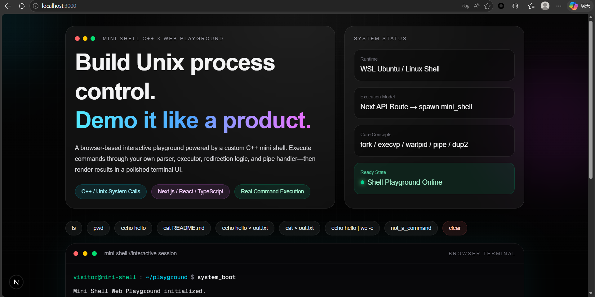
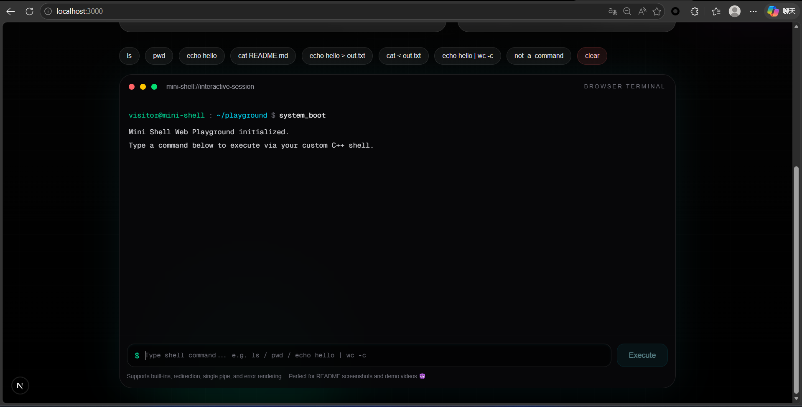
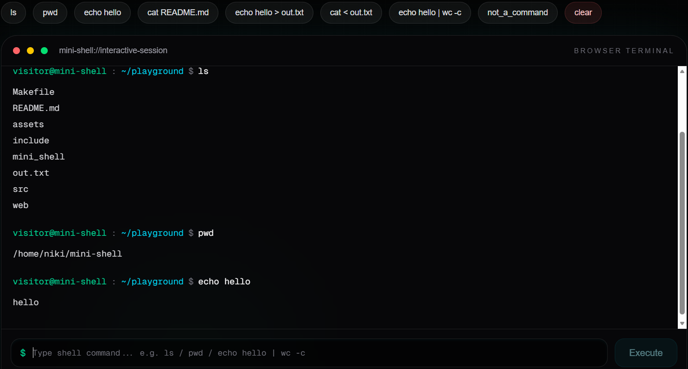
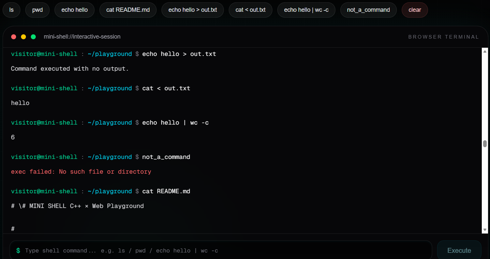
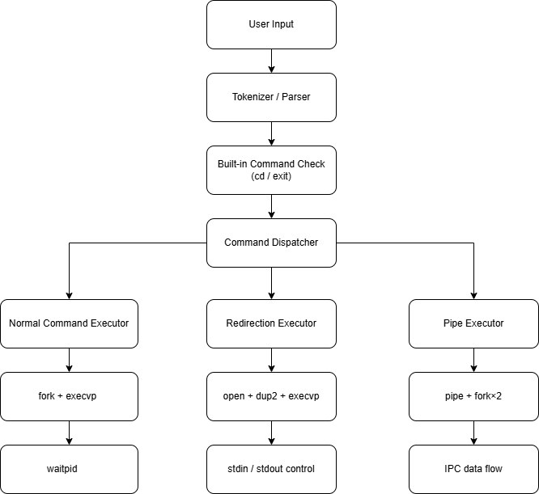

# 💻 MINI SHELL C++ × Web Playground

> **A modular Unix-style mini shell built with C++ and productized through a Next.js interactive browser playground.**

This project transforms classic **Unix process control concepts** into a **portfolio-ready interactive developer tool**, allowing users to execute real shell commands directly from a browser UI powered by a custom C++ shell backend.

It bridges:

> **System Programming × Full-Stack Product Engineering × Interactive Demo Experience**

---

## 🚀 Project Overview

This project implements a custom Linux-style mini shell in **modern C++**, supporting:

* built-in commands
* external command execution
* input/output redirection
* single pipe IPC
* error rendering
* browser-based interactive execution

Unlike a traditional terminal-only shell assignment, this project exposes the shell through a **Next.js web playground**, making low-level OS concepts directly explorable through a polished terminal-style product interface.

The browser UI sends commands to a **Next.js API route**, which spawns the compiled `mini_shell` executable and streams the result back into the browser terminal.

---

## 📸 System Preview

### 1) Product Hero Overview



### 2) Terminal Initial Ready State



### 3) Basic Command Execution



### 4) Advanced Shell Features

> Redirection · Pipe · Error Output · File Reading
> 

### 5) System Architecture



---

## 🧠 Execution Flow

```text
Browser UI (Next.js)
   ↓
API Route (/api/execute)
   ↓
spawn ./mini_shell
   ↓
C++ parser / dispatcher
   ↓
normal executor / redirection executor / pipe executor
   ↓
stdout / stderr
   ↓
browser terminal panel
```

---

## ✨ Core Engineering Highlights

### ⚙️ Shell Core (C++)

* Built-in commands: `cd`, `exit`
* External execution via `fork() + execvp()`
* Parent-child synchronization using `waitpid()`
* Input redirection `<`
* Output redirection `>`
* Single pipe `|`
* File descriptor control with `dup2()`
* Error propagation through `stderr`
* Modular parser / executor / pipe architecture

### 🌐 Web Playground (Next.js)

* Interactive terminal-style UI
* Real command execution via custom C++ shell
* Auto-scroll command history
* Colored stderr rendering
* Browser-based demo environment
* Stateless API execution architecture
* Quick command action buttons
* Product-style terminal UX

---

## 🛠️ Tech Stack

### System Layer

* C++
* Linux / WSL Ubuntu
* g++
* Unix system calls
* Makefile

### Web Layer

* Next.js
* React
* TypeScript
* Next API Routes
* Node.js `spawn()`

---

## 📂 Project Structure

```text
mini-shell/
├── src/
│   ├── main.cpp
│   ├── parser.cpp
│   ├── executor.cpp
│   └── pipe_executor.cpp
├── include/
│   ├── parser.h
│   ├── executor.h
│   └── pipe_executor.h
├── web/
│   ├── app/
│   │   ├── page.tsx
│   │   └── api/execute/route.ts
│   └── package.json
├── assets/
│   ├── 01-hero-overview.png
│   ├── 02-terminal-initial-state.png
│   ├── 03-basic-command-execution.png
│   ├── 04-advanced-shell-features.png
│   └── 05-system-architecture.png
├── Makefile
└── README.md
```

---

## ⚙️ Recommended Environment

* **WSL Ubuntu 22.04+**
* **g++ 11+**
* **Node.js 18+**
* **npm / pnpm**
* Linux shell runtime
* VSCode + WSL extension recommended

> 📌 This project is best demonstrated under **Linux / WSL**, since it relies on native Unix process control system calls.

---

## 🚀 Quick Start

### 1) Clone Repository

```bash
git clone <your-repo-url>
cd mini-shell
```

---

### 2) Build C++ Shell Core

#### Option A: Makefile (Recommended)

```bash
make
```

#### Option B: Manual Compile

```bash
g++ src/*.cpp -Iinclude -o mini_shell
```

---

### 3) Start Web Playground

```bash
cd web
npm install
npm run dev
```

---

### 4) Open Browser

```text
http://localhost:3000
```

---

## 🧪 Quick Demo Commands

Try these directly in the browser terminal:

```bash
pwd
ls
echo hello
echo hello > out.txt
cat < out.txt
echo hello | wc -c
invalid_cmd
```

These commands demonstrate:

* basic external execution
* stdout rendering
* file redirection
* single pipe IPC
* stderr error path rendering

---

## 🔧 Core Unix System Calls

* `fork()`
* `execvp()`
* `waitpid()`
* `pipe()`
* `dup2()`
* `open()`
* `chdir()`

These APIs form the foundation of:

> **process creation · IPC · file descriptor routing · shell execution flow**

---

## 🎯 Why This Project Stands Out

This is not just a shell assignment.

It productizes **Unix systems programming fundamentals** into a **browser-executable engineering showcase**, allowing interviewers and collaborators to directly explore:

* process creation
* command parsing
* file descriptor control
* pipe-based IPC
* stderr failure paths
* full-stack product integration

This significantly improves the **demonstrability and interview value** of classic OS projects.

---

## ⚠️ Common Issues

### 1) `mini_shell` Not Found

Rebuild the executable:

```bash
make
```

Make sure the output file is located in the project root.

---

### 2) `spawn ENOENT`

This usually means:

* wrong executable path
* build step not completed
* API route path mismatch

Verify:

```bash
ls mini_shell
```

---

### 3) `npm install` Failed

Check Node.js version:

```bash
node -v
```

Recommended:

```text
v18+
```

---

### 4) Windows Native Terminal Issues

Use:

> **WSL Ubuntu + VSCode Remote WSL**

instead of raw Windows PowerShell.

This avoids path and process-spawn inconsistencies.

---

## 🚀 Future Improvements

* Multiple pipe support (`cmd1 | cmd2 | cmd3`)
* Background job execution (`&`)
* Persistent session shell state
* Command history persistence
* Better syntax parsing
* Mixed pipe + redirection
* WebSocket-based long-lived shell runtime
* Session-isolated shell containers
* 🐳 Dockerized sandbox shell runtime

---

## 💼 Best Fit Roles

This project is especially suitable for:

* **Systems Engineering Internships**
* **Backend Engineering**
* **AI Infra / Platform Engineering**
* **Distributed Systems Foundations**
* **Unix Process Control Demonstrations**
* **Remote Full-Stack Engineering**

---

## 👤 Author

**Catherine**
Systems Programming · Full-Stack Product Engineering · Developer Tooling

---

